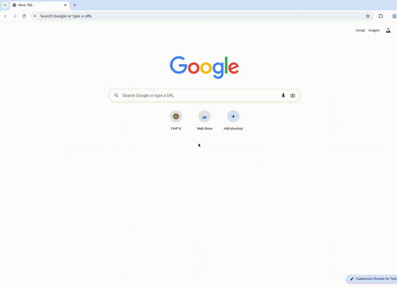

# FIAP X - Video Processing Platform

A microservices-based video processing platform built with FastAPI, RabbitMQ, MinIO, PostgreSQL, Redis, and Kubernetes.

## Demo



## Architecture

```
                    +---------------+
                    |    Client     |
                    |   (Browser)   |
                    +-------+-------+
                            |
                    +-------v-------+
                    |  API Gateway  |
                    |    (Nginx)    |
                    +-------+-------+
                            |
           +----------------+----------------+
           |                |                |
    +------v------+  +------v------+  +------v---------+
    | Auth Service|  |   Video     |  |  Notification  |
    |  (FastAPI)  |  |   Upload    |  |    Service     |
    |             |  |   Service   |  |   (Python)     |
    +------+------+  +------+------+  +--------+-------+
           |                |                   |
           |         +------v------+            |
           |         |  RabbitMQ   |            |
           |         |   (Queue)   |            |
           |         +------+------+            |
           |                |                   |
           |         +------v------+            |
           |         |   Video     |            |
           |         | Processing  |            |
           |         |   Service   |            |
           |         +------+------+            |
           |                |                   |
    +------v----------------v--------v----------+
    |          PostgreSQL + Redis                |
    +-------------------+------------------------+
                        |
                 +------v------+
                 |    MinIO    |
                 |  (Storage)  |
                 +-------------+
```

## Services

| Service | Technology | Port | Responsibility |
|---------|-----------|------|----------------|
| API Gateway | Nginx | 80 | Routing, rate limiting, frontend UI |
| Auth Service | FastAPI + PostgreSQL + Redis | 8001 | User registration, login, JWT tokens |
| Video Upload Service | FastAPI + MinIO + RabbitMQ | 8002 | Video upload, status management |
| Video Processing Service | Python + RabbitMQ + ffmpeg | 8003 | Concurrent video transcoding |
| Notification Service | Python + RabbitMQ + SMTP | 8004 | Email notifications on errors |

## Infrastructure

| Component | Technology | Purpose |
|-----------|-----------|---------|
| Message Broker | RabbitMQ | Async communication between services |
| Database | PostgreSQL | Data persistence (separate DB per service) |
| Cache | Redis | Token cache, video status cache |
| Object Storage | MinIO | S3-compatible video file storage |
| Email (dev) | MailHog | Local email testing |
| Monitoring | Prometheus + Grafana | Metrics and dashboards |
| Orchestration | Kubernetes (Minikube) | Container orchestration |
| CI/CD | GitHub Actions | Automated testing |

## Prerequisites

- **Docker** and **Docker Compose** (v2+)
- **Git**

For Kubernetes deployment:
- **Minikube**
- **kubectl**
- **envsubst** (part of `gettext` package)

## Quick Start (Docker Compose)

1. Clone the repository:
   ```bash
   git clone https://github.com/GustaSchmidt/fiap-hackaton.git
   cd fiap-hackaton
   ```

2. Copy the environment file and adjust values if needed:
   ```bash
   cp .env.example .env
   ```

3. Start all services:
   ```bash
   docker-compose up --build
   ```

4. Access the application:
   - **Frontend**: http://localhost
   - **RabbitMQ Management**: http://localhost:15672 (guest/guest)
   - **MinIO Console**: http://localhost:9001 (admin/password123)
   - **MailHog (email viewer)**: http://localhost:8025
   - **Prometheus**: http://localhost:9090
   - **Grafana**: http://localhost:3000 (admin/admin)

## Quick Start (Minikube)

Run the one-command setup script:
```bash
./setup-minikube.sh
```

This script will:
- Start Minikube with Docker driver
- Build all service images inside Minikube
- Apply Kubernetes manifests (namespace, secrets, deployments, services)
- Wait for all pods to be healthy
- Display access URLs

Access the application at `http://<minikube-ip>:30080`.

## Usage

### 1. Register a user

```bash
curl -X POST http://localhost/api/auth/register \
  -H "Content-Type: application/json" \
  -d '{"username": "testuser", "email": "test@example.com", "password": "secret123"}'
```

### 2. Login

```bash
curl -X POST http://localhost/api/auth/login \
  -H "Content-Type: application/x-www-form-urlencoded" \
  -d "username=testuser&password=secret123"
```

Save the `access_token` from the response.

### 3. Upload a video

```bash
curl -X POST http://localhost/api/videos/upload \
  -H "Authorization: Bearer <your-token>" \
  -F "file=@/path/to/video.mp4"
```

### 4. Check video status

```bash
curl http://localhost/api/videos/videos \
  -H "Authorization: Bearer <your-token>"
```

Status flow: `uploaded` -> `queued` -> `processing` -> `completed` (or `error`)

### 5. Check error notifications

Open MailHog at http://localhost:8025 to view email notifications sent when video processing fails.

## Video Processing

The Video Processing Service consumes messages from RabbitMQ and processes videos using **ffmpeg**. When a video is uploaded:

1. The Upload Service stores the file in MinIO and publishes a `video.uploaded` event
2. The Processing Service picks up the event and downloads the video from MinIO
3. ffmpeg transcodes the video to H.264/AAC MP4 format with configurable resolution
4. The processed file is uploaded back to MinIO in a `processed/` prefix
5. The video status is updated to `completed`
6. If processing fails, an error event is published and the Notification Service sends an email

### Configuration

| Environment Variable | Default | Description |
|---------------------|---------|-------------|
| `MAX_CONCURRENT_WORKERS` | 3 | Number of concurrent video processing threads |
| `FFMPEG_OUTPUT_RESOLUTION` | 720 | Output video height in pixels (e.g., 480, 720, 1080) |
| `MINIO_ENDPOINT` | minio:9000 | MinIO server address |
| `MINIO_ACCESS_KEY` | admin | MinIO access key |
| `MINIO_SECRET_KEY` | password123 | MinIO secret key |
| `MINIO_BUCKET` | videos | MinIO bucket name |

## Running Tests

Each service has its own test suite. Run all tests:

```bash
# Auth Service
cd services/auth-service && pip install -r requirements.txt && pytest -v

# Video Upload Service
cd services/video-upload-service && pip install -r requirements.txt && pytest -v

# Video Processing Service
cd services/video-processing-service && pip install -r requirements.txt && pytest -v

# Notification Service
cd services/notification-service && pip install -r requirements.txt && pytest -v
```

## Project Structure

```
.
├── .env.example                    # Environment variables template
├── .github/workflows/ci.yml       # GitHub Actions CI pipeline
├── ARCHITECTURE.md                 # Architecture documentation
├── README.md                       # This file
├── docker-compose.yml              # Docker Compose for local dev
├── setup-minikube.sh               # One-command Minikube setup
├── k8s/                            # Kubernetes manifests
│   ├── namespace.yaml
│   ├── secrets.yaml
│   ├── configmap.yaml
│   ├── postgres.yaml
│   ├── redis.yaml
│   ├── rabbitmq.yaml
│   ├── minio.yaml
│   ├── auth-service.yaml
│   ├── video-upload-service.yaml
│   ├── video-processing-service.yaml
│   ├── notification-service.yaml
│   ├── api-gateway.yaml
│   ├── mailhog.yaml
│   └── monitoring.yaml
├── monitoring/                     # Prometheus + Grafana config
│   ├── prometheus.yml
│   └── .grafana/provisioning/
├── scripts/
│   └── init-databases.sh           # PostgreSQL init script
└── services/
    ├── api-gateway/                # Nginx + frontend UI
    │   ├── Dockerfile
    │   ├── nginx.conf
    │   └── frontend/
    ├── auth-service/               # Authentication microservice
    │   ├── Dockerfile
    │   ├── requirements.txt
    │   ├── app/
    │   └── tests/
    ├── video-upload-service/       # Video upload microservice
    │   ├── Dockerfile
    │   ├── requirements.txt
    │   ├── app/
    │   └── tests/
    ├── video-processing-service/   # Video processing microservice
    │   ├── Dockerfile
    │   ├── requirements.txt
    │   ├── app/
    │   └── tests/
    └── notification-service/       # Notification microservice
        ├── Dockerfile
        ├── requirements.txt
        ├── app/
        └── tests/
```

## Environment Variables

Copy `.env.example` to `.env` before running. Key variables:

| Variable | Default | Description |
|----------|---------|-------------|
| `POSTGRES_USER` | fiapx | PostgreSQL username |
| `POSTGRES_PASSWORD` | fiapx123 | PostgreSQL password |
| `RABBITMQ_DEFAULT_USER` | guest | RabbitMQ username |
| `RABBITMQ_DEFAULT_PASS` | guest | RabbitMQ password |
| `MINIO_ROOT_USER` | admin | MinIO root username |
| `MINIO_ROOT_PASSWORD` | password123 | MinIO root password |
| `SECRET_KEY` | fiapx-secret-key-change-in-production | JWT signing key |
| `GF_SECURITY_ADMIN_USER` | admin | Grafana admin username |
| `GF_SECURITY_ADMIN_PASSWORD` | admin | Grafana admin password |

## Monitoring

- **Prometheus** collects metrics from all services at http://localhost:9090
- **Grafana** provides dashboards at http://localhost:3000
  - Pre-configured with Prometheus data source
  - Includes a FIAP X dashboard with service health metrics

## Key Design Decisions

1. **Asynchronous Processing**: Video uploads are decoupled from processing via RabbitMQ, ensuring no requests are lost during peak loads.
2. **Concurrent Processing**: The Video Processing Service uses a ThreadPoolExecutor to process multiple videos simultaneously.
3. **JWT Authentication**: Stateless token-based auth with bcrypt password hashing. Tokens are cached in Redis for fast validation.
4. **Database per Service**: Each service has its own PostgreSQL database for loose coupling.
5. **Scalability**: Each service can be independently scaled via Kubernetes replicas.
6. **Error Handling**: Failed video processing triggers notification events, and the Notification Service sends emails to users.
7. **Real Video Processing**: ffmpeg-based transcoding with configurable output resolution.
